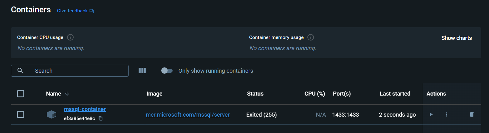
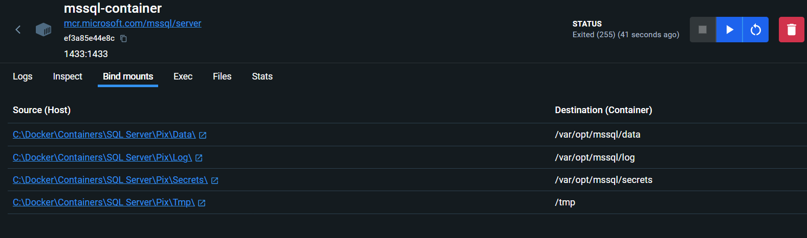
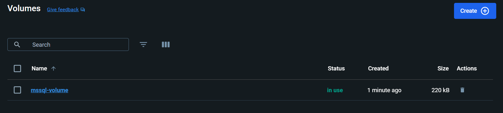
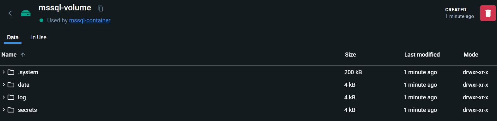
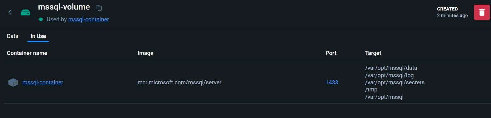

<details><summary>CP</summary>

<br/>

Copy files from a container

```ps
docker cp <Container ID>:<Container path> <host path>
```

Copy files into a container

```ps
docker cp <Host path> <Container ID>:<Container path>
```

</details>

<details><summary>MSSQL</summary>

<br/>

A volume can be attached on the Microsoft SQL Server too, as described on the [Microsoft Documentation](https://learn.microsoft.com/en-us/sql/linux/sql-server-linux-docker-container-deployment?view=sql-server-ver15&pivots=cs1-bash#persist):

[Configurar e personalizar contêineres do SQL Server no Docker](https://learn.microsoft.com/pt-br/sql/linux/sql-server-linux-docker-container-configure?view=sql-server-ver16&pivots=cs1-bash)

Using the above command to mount four folders of the container to a host directory and use a data volume container:

```ps
docker run 
--name container-name 
--env 'ACCEPT_EULA=Y' 
--env 'SA_PASSWORD=password' 
--publish 1433:1433 
--volume <VOLUME>:/var/opt/mssql 
--volume='C:\Docker\Containers\SQL Server\Data\':/var/opt/mssql/data 
--volume='C:\Docker\Containers\SQL Server\Log\':/var/opt/mssql/log 
--volume='C:\Docker\Containers\SQL Server\Secrets\':/var/opt/mssql/secrets 
--volume='C:\Docker\Containers\SQL Server\Tmp\':/tmp 
--detach mcr.microsoft.com/mssql/server
```

Example:

```ps
docker run --name mssql-container --env 'ACCEPT_EULA=Y' --env 'SA_PASSWORD=!1q@2w#3e%5t' --publish 1433:1433 --volume mssql-volume:/var/opt/mssql --volume='C:\Docker\Containers\SQL Server\Data\':/var/opt/mssql/data --volume='C:\Docker\Containers\SQL Server\Log\':/var/opt/mssql/log --volume='C:\Docker\Containers\SQL Server\Secrets\':/var/opt/mssql/secrets --volume='C:\Docker\Containers\SQL Server\Tmp\':/tmp --detach mcr.microsoft.com/mssql/server
```

### Container





### Volume







</details>
